# Big Mart Sales Prediction

Predicting sales for Big Mart stores

## Introduction

The Big Mart Sales Prediction project aims to predict the sales of products in Big Mart stores. By analyzing various features such as item weight, item visibility, and store location, the project leverages machine learning techniques to provide accurate sales predictions. This information can be used by the store management to make informed decisions regarding inventory management, promotions, and overall business strategies.

## Dependencies

To run this project, the following dependencies are required:

- numpy
- pandas
- matplotlib
- seaborn
- scikit-learn
- xgboost

## Data Collection and Processing

The project involves collecting and processing data from a CSV file. The data is loaded into a Pandas DataFrame, and basic information about the dataset is obtained. The missing values are handled, and necessary preprocessing steps are performed to prepare the data for analysis and modeling.

Code snippet:

```python
# Importing the Dependencies
import numpy as np
import pandas as pd

# Loading the data from a CSV file to Pandas DataFrame
big_mart_data = pd.read_csv('Train.csv')

# First 5 rows of the dataframe
big_mart_data.head()

# Number of data points & number of features
print("Shape of the dataframe:", big_mart_data.shape)

# Getting some information about the dataset
big_mart_data.info()
```

Screenshot:

<!-- Add screenshot of loaded data -->
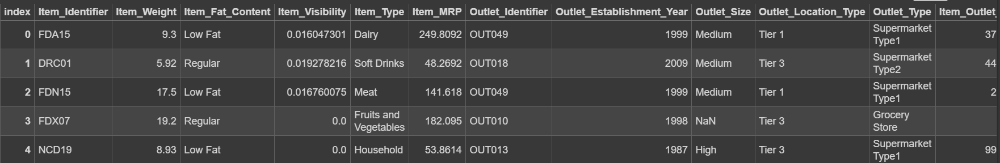


## Data Analysis

The project conducts a comprehensive analysis of the data, including various visualizations and statistical insights. Distribution plots and count plots are used to understand the distribution of numerical and categorical features. These visualizations provide valuable insights into the data, helping to identify patterns and trends.

Code snippet:

```python
import matplotlib.pyplot as plt
import seaborn as sns

sns.set()

# Item_Weight distribution
plt.figure(figsize=(6,6))
sns.distplot(big_mart_data['Item_Weight'])
plt.title('Item Weight Distribution')
plt.xlabel('Item Weight')
plt.ylabel('Density')
plt.show()

# Item Visibility distribution
plt.figure(figsize=(6,6))
sns.distplot(big_mart_data['Item_Visibility'])
plt.title('Item Visibility Distribution')
plt.xlabel('Item Visibility')
plt.ylabel('Density')
plt.show()

# Item MRP distribution
plt.figure(figsize=(6,6))
sns.distplot(big_mart_data['Item_MRP'])
plt.show()

# Item_Outlet_Sales distribution
plt.figure(figsize=(6,6))
sns.distplot(big_mart_data['Item_Outlet_Sales'])
plt.show()

# Outlet_Establishment_Year column
plt.figure(figsize=(6,6))
sns.countplot(x='Outlet_Establishment_Year', data=big_mart_data)
plt.show()

# Item_Fat_Content column
plt.figure(figsize=(6,6))
sns.countplot(x='Item_Fat_Content', data=big_mart_data)
plt.show()

# Item_Type column
plt.figure(figsize=(30,6))
sns.countplot(x='Item_Type', data=big_mart_data)
plt.show()

# Outlet_Size column
plt.figure(figsize=(6,6))
sns.countplot(x='Outlet_Size', data=big_mart_data)
plt.show()

```

Screenshots:

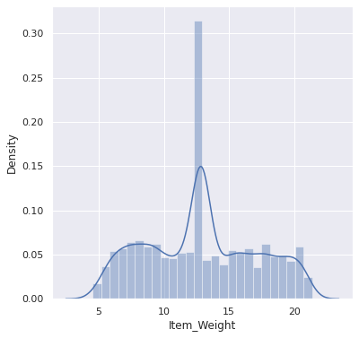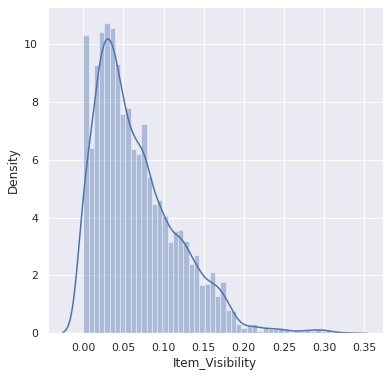 
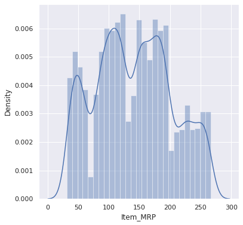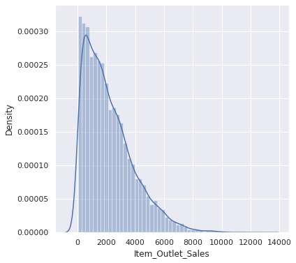
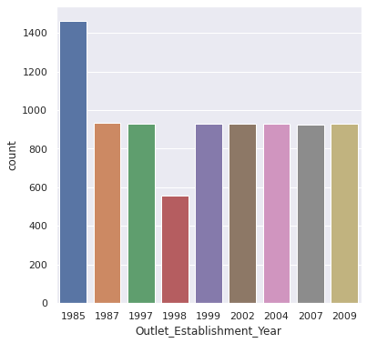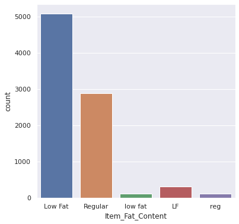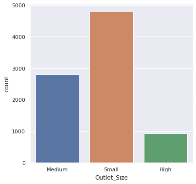
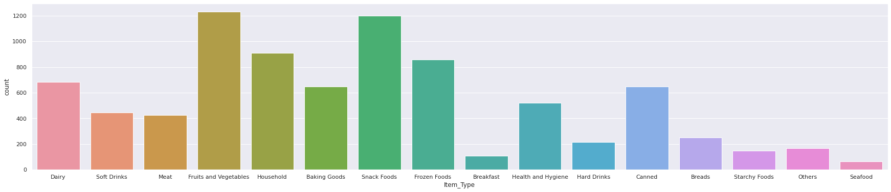

## Data Pre-Processing

The data undergoes pre-processing steps to handle missing values and prepare categorical features for modeling. Missing values are filled using appropriate techniques such as mean or mode imputation. Categorical features are encoded using label encoding to convert them into numerical representations, enabling the machine learning model to process the data effectively.

Code snippet:

```python
from sklearn.preprocessing import LabelEncoder

# Handling missing values
big_mart_data['Item_Weight'].fillna(big_mart_data['Item_Weight'].mean(), inplace=True))

# Label Encoding
encoder = LabelEncoder()
big_mart_data['Item_Fat_Content'] = encoder.fit_transform(big_mart_data['Item_Fat_Content'])

```

Screenshot:

<!-- Add screenshot of preprocessed data -->
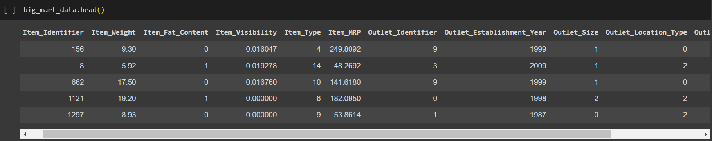

## Machine Learning Model Training

The project utilizes the XGBoost algorithm for training the machine learning model. The features and target variable are split into training and testing datasets using the train-test split method. The XGBoost regressor is trained on the training data to learn the underlying patterns and make accurate sales predictions.

Code snippet:

```python
from sklearn.model_selection import train_test_split
from xgboost import XGBRegressor

# Splitting features and target
X = big_mart_data.drop(columns='Item_Outlet_Sales', axis=1)
Y = big_mart_data['Item_Outlet_Sales']

# Splitting the data into training and testing data
X_train, X_test, Y_train, Y_test = train_test_split(X, Y, test_size=0.2, random_state=2)

# XGBoost Regressor
regressor = XGBRegressor()
regressor.fit(X_train, Y_train)
```


## Evaluation

The trained model is evaluated using evaluation metrics such as R-squared value. These metrics measure the performance of the model in predicting sales. The evaluation provides insights into how well the model generalizes to unseen data.

Code snippet:

```python
from sklearn import metrics

# Prediction on training data
training_data_prediction = regressor.predict(X_train)
r2_train = metrics.r2_score(Y_train, training_data_prediction)
print('R-squared value on training data:', r2_train)

# Prediction on test data
test_data_prediction = regressor.predict(X_test)
r2_test = metrics.r2_score(Y_test, test_data_prediction)
print('R-squared value on test data:', r2_test)
```

Screenshot:

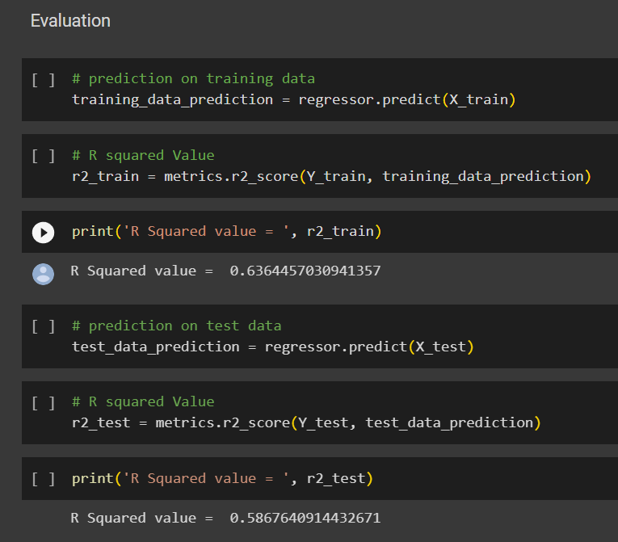
